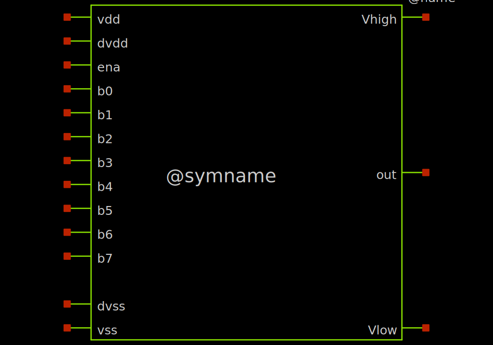
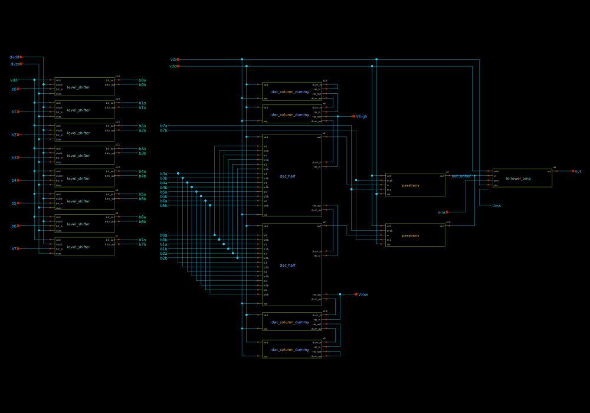
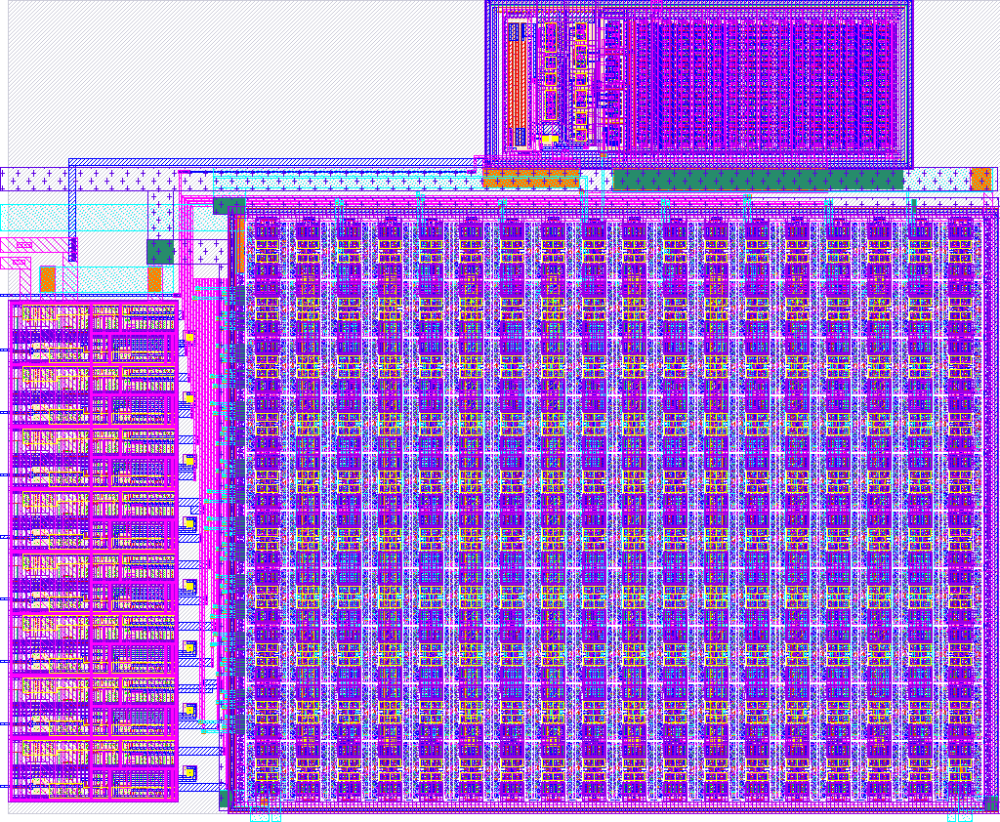
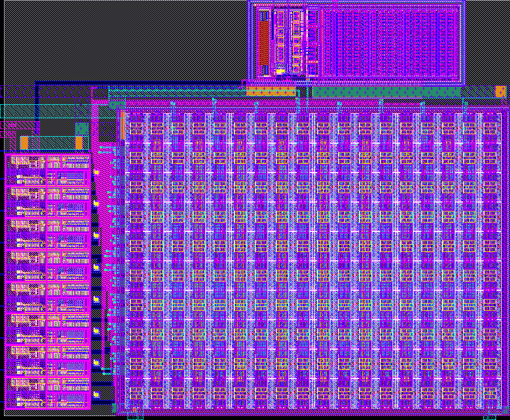

# sky130_ef_ip__rdac3v_8bit

- Description: 8-bit DAC with 3.3V supply and enable input
- Commit: N/A
- PDK: sky130A

## Authorship

- Designer: Tim Edwards
- Company: Efabless Corporation
- Created: November 21, 2023
- License: Apache 2.0
- Last modified: None

## Pins

- b7:0
  + Description: Digital input (8 bits)
  + Type: digital
  + Direction: input
  + Vmin: vss - 0.3
  + Vmax: dvdd + 0.3
- ena
  + Description: Enable input (active low)
  + Type: digital
  + Direction: input
  + Vmin: vss - 0.3
  + Vmax: dvdd + 0.3
- Vhigh
  + Description: Reference high voltage
  + Type: signal
  + Direction: input
  + Vmin: Vlow
  + Vmax: vdd
- Vlow
  + Description: Reference low voltage
  + Type: signal
  + Direction: input
  + Vmin: vss
  + Vmax: Vhigh
- out
  + Description: DAC voltage output
  + Type: signal
  + Direction: output
  + Vmin: Vlow
  + Vmax: Vhigh
- dvdd
  + Description: Positive digital power supply
  + Type: power
  + Direction: inout
  + Vmin: 1.5
  + Vmax: 2.1
- dvss
  + Description: Digital ground
  + Type: ground
  + Direction: inout
  + Vmin: -0.3
  + Vmax: 0.3
- vdd
  + Description: Positive analog power supply
  + Type: power
  + Direction: inout
  + Vmin: 3.0
  + Vmax: 3.6
- vss
  + Description: Analog ground
  + Type: ground
  + Direction: inout
  + Vmin: -0.3
  + Vmax: 0.3

## Default Conditions

- Vdvdd
  + Description: Digital power supply voltage
  + Display: dvdd
  + Unit: V
  + Typical: 1.8
- Vdvss
  + Description: Digital ground
  + Display: dvss
  + Unit: V
  + Typical: 0
- Vvdd
  + Description: Analog power supply voltage
  + Display: vdd
  + Unit: V
  + Typical: 3.3
- Vvss
  + Description: Analog ground
  + Display: vss
  + Unit: V
  + Typical: 0
- Rout
  + Description: Output load resistance
  + Display: RLoad
  + Unit: MΩ
  + Typical: 100
- Cout
  + Description: Output load capacitance
  + Display: CLoad
  + Unit: fF
  + Maximum: 100
- Vlow
  + Description: DAC low voltage reference
  + Display: Vlow
  + Unit: V
  + Typical: 0
- Vhigh
  + Description: DAC high voltage reference
  + Display: Vhigh
  + Unit: V
  + Typical: 3.3
- ena
  + Description: DAC enable
  + Display: ena
  + Typical: 1
- b[7:0]
  + Description: DAC digital input value
  + Display: b[7:0]
  + Typical: 0
- temperature
  + Description: Ambient temperature
  + Display: Temp
  + Unit: °C
  + Minimum: -40
  + Typical: 27
  + Maximum: 130
- corner
  + Description: Process corner
  + Display: Corner
  + Minimum: ss
  + Typical: tt
  + Maximum: ff

## Symbol

## Schematic

## Layout

