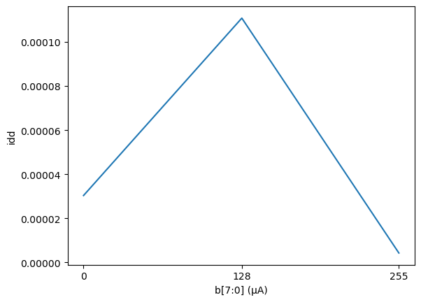
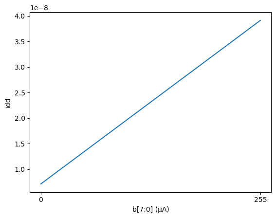
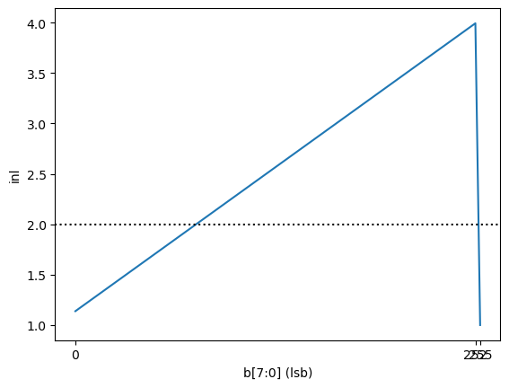
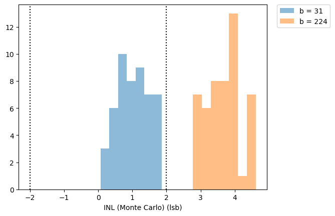
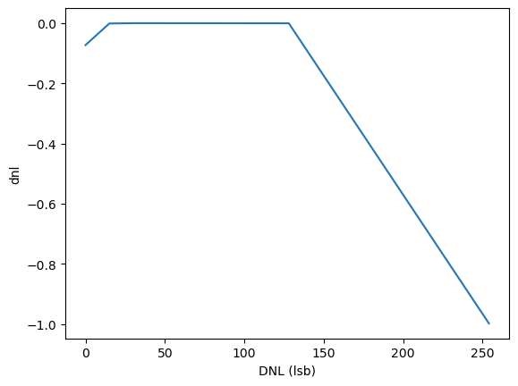
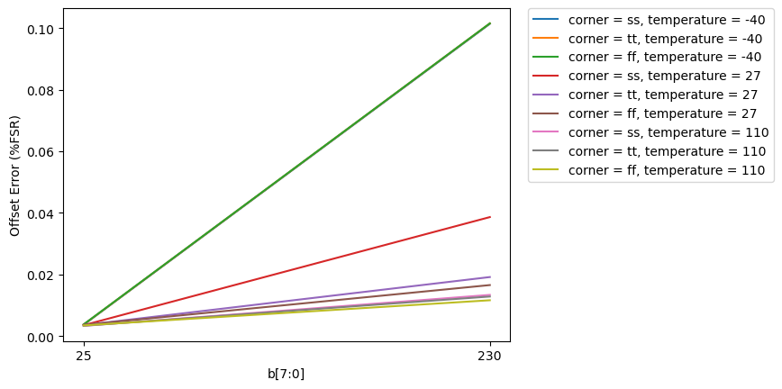
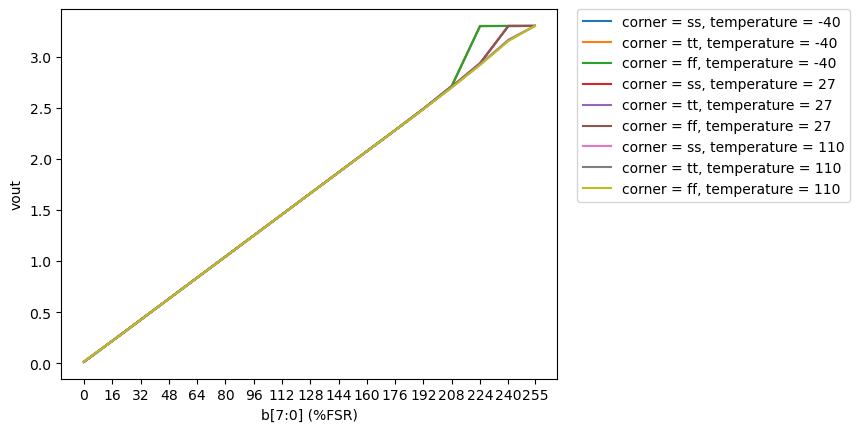
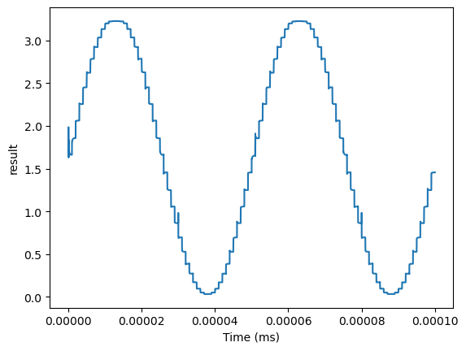

# CACE Summary for sky130_ef_ip__rdac3v_8bit

**netlist source**: schematic

|      Parameter       |         Tool         |     Result      | Min Limit  |  Min Value   | Typ Target |  Typ Value   | Max Limit  |  Max Value   |  Status  |
| :------------------- | :------------------- | :-------------- | ---------: | -----------: | ---------: | -----------: | ---------: | -----------: | :------: |
| Idd                  | ngspice              | idd                  |             any |   4.214 µA |       170 µA |  30.309 µA |       250 µA | 110.840 µA |   Pass ✅    |
| Standby current      | ngspice              | idd                  |             any |   0.007 µA |       170 µA |   0.023 µA |       250 µA |   0.039 µA |   Pass ✅    |
| INL                  | ngspice              | inl                  |          -2 lsb |  0.998 lsb |        0 lsb |  1.136 lsb |        2 lsb |  3.995 lsb |   Fail ❌    |
| INL (Monte Carlo)    | ngspice              | inl                  |          -2 lsb |  0.068 lsb |        0 lsb |  2.315 lsb |        2 lsb |  4.620 lsb |   Fail ❌    |
| DNL                  | ngspice              | dnl                  |          -2 lsb | -0.998 lsb |        0 lsb | -0.001 lsb |        2 lsb | -0.000 lsb |   Pass ✅    |
| Offset Error         | ngspice              | offset_error         |         -2 %FSR | 0.332 %FSR |       0 %FSR | 0.773 %FSR |       1 %FSR | 10.154 %FSR |   Fail ❌    |
| Gain Error           | ngspice              | gain_error           |         -2 %FSR | 0.097 %FSR |       0 %FSR | 1.521 %FSR |       2 %FSR | 4.184 %FSR |   Fail ❌    |
| Area                 | magic_area           | area                 |               ​ |          ​ |            ​ |          ​ |          any |          ​ |   Skip 🟧    |
| Width                | magic_area           | width                |               ​ |          ​ |            ​ |          ​ |          any |          ​ |   Skip 🟧    |
| Height               | magic_area           | height               |               ​ |          ​ |            ​ |          ​ |          any |          ​ |   Skip 🟧    |
| Magic DRC            | magic_drc            | drc_errors           |               ​ |          ​ |            ​ |          ​ |            0 |          ​ |   Skip 🟧    |
| Netgen LVS           | netgen_lvs           | lvs_errors           |               ​ |          ​ |            ​ |          ​ |            0 |          ​ |   Skip 🟧    |
| KLayout DRC feol     | klayout_drc          | drc_errors           |               ​ |          ​ |            ​ |          ​ |            0 |          ​ |   Skip 🟧    |
| KLayout DRC beol     | klayout_drc          | drc_errors           |               ​ |          ​ |            ​ |          ​ |            0 |          ​ |   Skip 🟧    |
| KLayout DRC full     | klayout_drc          | drc_errors           |               ​ |          ​ |            ​ |          ​ |            0 |          ​ |   Skip 🟧    |

## Plots

## idd_enabled

## idd_disabled

## inl

## inl_mc

## dnl

## offset_error

## transfer_function

## transient_sine

